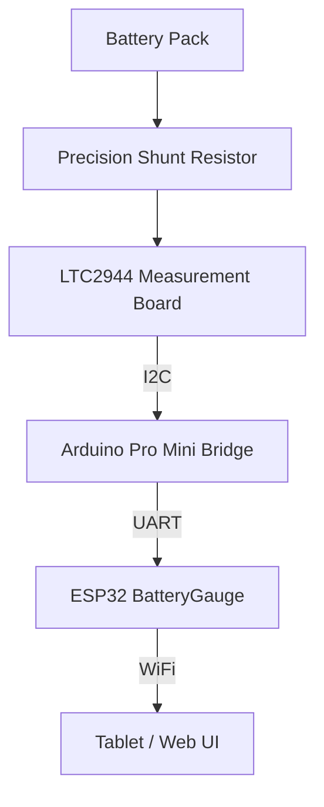

# LTC2944 Measurement Board – Hardware Design

## Overview

The **LTC2944 measurement board** is a dedicated electrical sensing module used by the **ESP32 BatteryGauge system**.

This board performs the low-level measurements required for battery monitoring and exposes them via an **I²C interface** to the Arduino Pro Mini bridge firmware.

The board measures:

- battery pack voltage
- current through a precision shunt resistor
- internal temperature of the LTC2944
- accumulated charge register (ACR)

These measurements are processed by the **Pro Mini bridge firmware**, which converts them into normalized battery telemetry for the ESP32 BatteryGauge system.

---

## Hardware Photo

---

# System Context

The LTC2944 measurement board forms the **lowest layer of the BatteryGauge measurement chain**.

## Layer responsibilities
| Component | Responsibility |
|-----------|---------------|
|Battery	|Energy storage
|Shunt resistor	|Current sensing
|LTC2944 board	|Electrical measurement
|Pro Mini	|Sensor processing and calibration
|ESP32	|UI, networking and visualization

## Design Goals

The measurement board was designed with the following goals:

- accurate battery current measurement
- reliable pack voltage measurement
- minimal analog complexity
- high current capability
- simple digital interface
- compatibility with multiple battery chemistries

The LTC2944 integrates most measurement functions into a single device, significantly simplifying the hardware.

## LTC2944 Overview

The LTC2944 is a battery-monitoring IC designed for high-side current sensing and battery-telemetry applications.

Key capabilities used in this design:

- 3.6V – 60V operating voltage
- high-side current sensing
- integrated coulomb counter
- pack voltage measurement
- internal temperature sensor
- I²C interface

In this system, the device operates in automatic measurement mode, continuously updating measurement registers.

## Electrical Measurement Chain

Battery current flows through a precision shunt resistor placed in the battery path.
The LTC2944 measures the voltage drop across this resistor to determine current.
~~~~
Battery + ---- Shunt ---- System Load
               |   |
                 +--> LTC2944 current sense
~~~~
Because the LTC2944 performs high-side sensing, the measurement circuit does not disturb the system ground reference.

## Shunt Resistor

The system uses a low-value precision shunt resistor.
Typical configuration:

Rshunt = 0.01 Ω (10 mΩ)

Advantages:

- low power dissipation
- minimal voltage drop
- adequate measurement resolution

The current measurement equation used by firmware is derived from the LTC2944 datasheet:

I = (0.064V / Rshunt) * ((rawCurrent - 32767) / 32767)

## Voltage Measurement

The LTC2944 also measures battery pack voltage internally.

The firmware converts the raw register value using:

Vpack = 70.8 V * raw / 65535

Although the LTC2944 supports up to 60 V, the BatteryGauge system intentionally limits supported battery configurations to common real-world systems:

- lithium battery packs up to 12S
- 12V lead batteries
- 24V lead batteries
- 48V lead batteries

This improves safety margins and simplifies configuration.

## Temperature Measurement

The LTC2944 includes an internal temperature sensor.
Firmware converts the raw temperature register using:

- Temperature(K) = 510 * raw / 65535
- Temperature(C) = Temperature(K) - 273.15

Temperature is used primarily for:

- system diagnostics
- calibration monitoring
- safety limits

I²C Communication

The measurement board communicates with the Arduino Pro Mini using the I²C bus.

|Signal	|Function|
|-----------|---------------|
|SDA	|I²C data|
|SCL	|I²C clock|
|GND	|Ground|
|VCC	|Supply reference|

Default I²C address: 0x64

The Pro Mini reads the following registers:

|Register	|Measurement|
|-----------|---------------|
|Voltage 0x08	|Battery pack voltage|
|Current 0x0E	|Shunt current|
|Temperature 0x14	|Internal sensor|
|ACR 0x02	|Coulomb counter|

## Power Supply

The LTC2944 board is powered directly from the battery pack voltage.
Because the device supports up to 60 V, no additional voltage regulator is required for the measurement IC.
The Arduino Pro Mini uses its own regulated supply.

## Connectors

The board uses high-current screw terminals (100A) to connect the battery.

Typical configuration:

|Terminal	|Function|
|-----------|---------------|
|B+	|Battery positive|
|C/L|Charger / Load|

These terminals support M6 bolt connections and are sized for high current applications.

## I²C Interface Header

The board connects to the Pro Mini using a small 5-pin header.

Typical connections:

|Pin	|Connection|
|-----------|---------------|
|SDA	|Pro Mini A4|
|SCL	|Pro Mini A5|
|GND	|Common ground|
|VCC |3V3|
|ALCC|NC|

Several PCB layout strategies were used to improve measurement accuracy and reliability.

## Kelvin Shunt Connections

The LTC2944 measures shunt voltage using a 1% tolerance sense resistor with Kelvin sense connections.
This minimizes measurement error.

## High Current Path

High-current battery traces are designed using:

- wide copper pours
- short current paths
- direct connections to the shunt resistor

## Thermal Management

The shunt resistor and connector area includes thermal vias that spread heat into the PCB layers.
This reduces local hot spots during sustained current flow.

## Summary

The LTC2944 measurement board provides a robust hardware front-end for the BatteryGauge system.
Key characteristics:

- accurate high-side current sensing
- integrated voltage and temperature measurement
- simple I²C interface
- high-current capable PCB design

When combined with the Pro Mini bridge firmware and the ESP32 BatteryGauge UI, the design forms a modular, extensible battery-monitoring platform.
