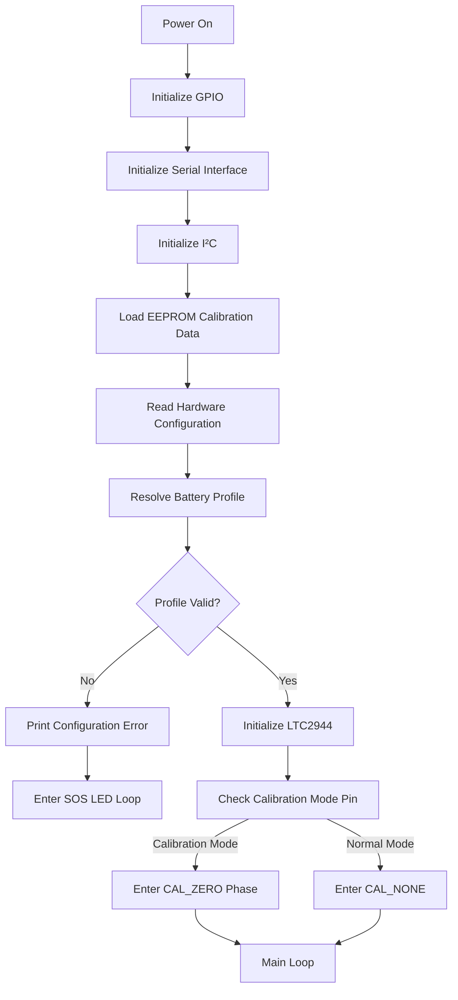
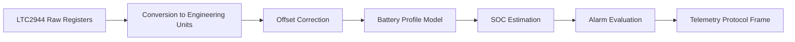
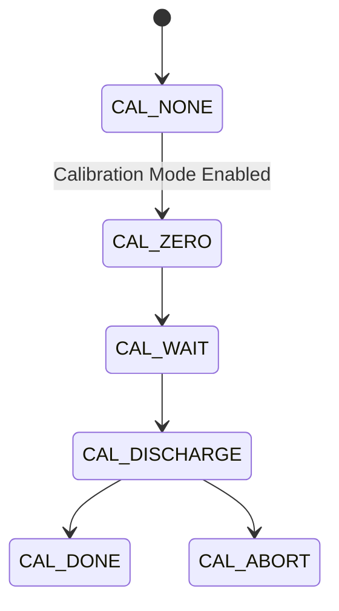
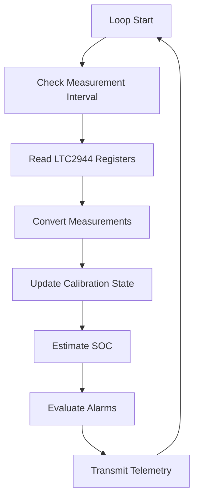

# Pro Mini LTC2944 Bridge – Software Architecture

## Overview

This document describes the internal software architecture of the **Pro Mini LTC2944 bridge firmware**.

The firmware runs on an **Arduino Pro Mini (ATmega328P)** and acts as a dedicated **battery sensor node** within the ESP32 BatteryGauge system.

Its responsibilities are:

- interfacing with the LTC2944 battery monitor
- converting raw sensor data into engineering units
- determining battery profile characteristics
- estimating battery state of charge (SOC)
- supporting calibration procedures
- detecting invalid hardware configuration
- generating telemetry for the ESP32

The firmware is intentionally kept **deterministic and modular** to ensure predictable sensor behavior.

---

# Software Structure

The firmware consists of several logical layers.

```
Application Layer
│
├── Telemetry protocol generation
├── Alarm evaluation
└── SOC estimation
│
Measurement Processing Layer
│
├── Raw sensor conversion
├── Calibration correction
└── Battery profile interpretation
│
Hardware Interface Layer
│
├── LTC2944 driver (I²C)
├── Hardware configuration pins
└── LED and load control
```

---

# Startup Sequence

The firmware follows a defined startup sequence to ensure safe operation.



Key steps:

1. Hardware interfaces are initialized.
2. Calibration offset is loaded from EEPROM.
3. Battery configuration is read from hardware pins.
4. The battery profile is resolved.
5. Invalid configurations trigger **SOS fault state**.
6. LTC2944 measurement begins.

---

# Hardware Configuration Parsing

Battery configuration is determined using hardware input pins.

This design ensures configuration:

- is visible on the PCB
- persists across firmware updates
- cannot be accidentally changed by software

## Chemistry Selection

Two pins determine battery chemistry.

| Code | Chemistry |
|-----|-----------|
| 00 | Li-ion |
| 01 | LiFePO4 |
| 10 | AGM |
| 11 | GEL |

## Battery Class Selection

Four pins define the battery voltage class.

### Lithium batteries

| Code | Battery |
|------|--------|
| 0000 | 1S |
| 0001 | 2S |
| 0010 | 3S |
| 0011 | 4S |
| 0100 | 6S |
| 0101 | 8S |
| 0110 | 12S |
| 0111 | 14S |

### Lead batteries

| Code | Battery |
|------|--------|
| 0000 | 12V |
| 0001 | 24V |
| 0010 | 48V |

Invalid combinations result in a **system fault state**.

---

# LTC2944 Driver Layer

The firmware includes a minimal LTC2944 driver implemented using I²C.

Driver responsibilities:

- reading register values
- writing configuration registers
- returning raw measurement values

Key registers used:

| Register | Purpose |
|--------|--------|
| 0x00 | Status |
| 0x01 | Control |
| 0x02 | Accumulated Charge (ACR) |
| 0x08 | Voltage |
| 0x0E | Current |
| 0x14 | Temperature |

The driver exposes simple helper functions:

- `readRegister8()`
- `readRegister16()`
- `writeRegister8()`

These functions abstract the I²C communication details from the rest of the firmware.

---

# Measurement Processing Pipeline

Raw sensor data passes through a defined processing pipeline.



---

# Raw Sensor Conversion

Raw LTC2944 measurements are converted into engineering units.

| Measurement | Conversion |
|-------------|-----------|
| Voltage | raw → volts |
| Current | raw → amps |
| Temperature | raw → °C |

Current measurements include **offset correction** obtained during calibration.

---

# SOC Estimation

SOC estimation uses **battery chemistry specific voltage models**.

Different estimation functions exist for:

- Li-ion
- LiFePO4
- Lead-acid batteries (AGM / GEL)

The SOC estimator compensates slightly for **charging voltage bias**.

The estimation approach prioritizes:

- simplicity
- stability
- predictable behavior

---

# Calibration State Machine

Calibration is implemented as a state machine.



### CAL_ZERO

Measures zero-current offset.

Steps:

1. multiple samples collected
2. average offset calculated
3. result stored in EEPROM

---

### CAL_WAIT

Allows the system to stabilize before discharge begins.

---

### CAL_DISCHARGE

The calibration load is activated.

Battery is discharged while measurements are monitored.

Calibration ends when:

- voltage reaches empty threshold
- timeout occurs
- temperature becomes unsafe

---

### CAL_DONE

Calibration completed successfully.

---

### CAL_ABORT

Calibration stopped due to safety conditions.

---

# EEPROM Usage

EEPROM is used to store calibration offset.

Stored values:

| Field | Purpose |
|------|--------|
| Magic value | Detect valid calibration |
| Current offset | Zero-current calibration |

If the magic value is missing or invalid, the offset defaults to zero.

---

# Telemetry Protocol

The Pro Mini transmits telemetry frames to the ESP32.

Example frame:

```
SOC=92,Vpack=4094,I=0,T=167,AL=0,CHG=0,CAL=0,CPH=0,CLOAD=0,BTYPE=0,BCLASS=0,BNAME=LIION_1S,ACR=32767,CRAWI=32768*XX
```

Fields include:

| Field | Description |
|------|-------------|
| SOC | state of charge |
| Vpack | battery voltage (mV) |
| I | current (mA) |
| T | temperature |
| AL | alarm flags |
| CHG | charging flag |
| CAL | calibration mode |
| CPH | calibration phase |
| CLOAD | calibration load state |
| BTYPE | battery chemistry |
| BCLASS | battery class |
| BNAME | battery profile name |
| ACR | accumulated charge register |
| CRAWI | raw current register |

A **CRC-8 checksum** is appended to detect transmission errors.

---

# Error Handling

The firmware handles several error conditions.

### Unsupported Configuration

Behavior:

1. error printed to serial port
2. LED enters SOS pattern
3. telemetry disabled

---

### Sensor Read Failure

If an LTC2944 read fails:

- an alarm flag is set
- telemetry continues

---

### Measurement Limits

The firmware monitors:

- voltage limits
- temperature limits
- current limits

Violations generate alarm flags in the telemetry frame.

---

# LED State Signaling

The onboard LED communicates system state.

| LED State | Meaning |
|----------|---------|
| OFF | Normal operation |
| ON | Calibration active |
| SOS blink | Configuration error |

---

# Main Loop Behavior

The firmware operates in a timed loop.



Measurements are typically transmitted **once per second**.

---

# Summary

The firmware architecture separates responsibilities into clear layers:

- hardware interface
- measurement processing
- battery modeling
- telemetry generation

This structure provides:

- predictable operation
- easier debugging
- safe calibration procedures
- extensibility for future improvements

The Pro Mini therefore functions as a **robust embedded battery sensor node** within the larger BatteryGauge system.
