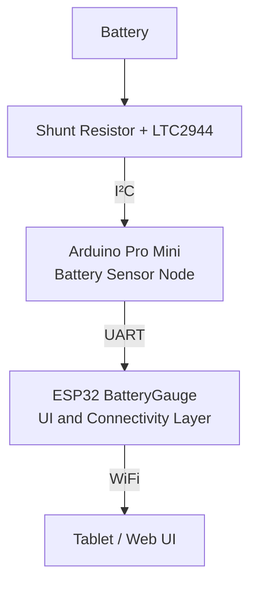

# Pro Mini LTC2944 Bridge – Solution Architecture

## Overview

The **Pro Mini LTC2944 bridge** is a dedicated battery measurement node used in the **ESP32 BatteryGauge system**.

Its primary role is to convert raw measurements from the **LTC2944 battery monitor IC** into normalized battery telemetry that can be consumed by the **ESP32 BatteryGauge application**.

The bridge provides:

- battery voltage measurement  
- battery current measurement  
- battery temperature measurement  
- battery state-of-charge estimation (SOC)  
- battery profile awareness  
- calibration capability  
- safe-state handling  

The Pro Mini communicates with the ESP32 using a simple **serial telemetry protocol**.

The ESP32 is responsible for:

- user interface
- WiFi connectivity
- visualization
- logging and analytics

This architecture separates **low-level battery sensing** from **application and UI logic**.

---

# System Context

The system consists of three logical layers.

### Responsibilities per layer

| Component | Responsibility |
|-----------|---------------|
| Battery | Energy storage |
| Shunt + LTC2944 | Electrical measurement |
| Pro Mini bridge | Measurement processing and calibration |
| ESP32 BatteryGauge | UI, networking, visualization |

---

# Why this module exists

The LTC2944 provides **raw electrical measurements**, but integrating the sensor directly into the application layer introduces several challenges:

- calibration logic becomes mixed with UI logic  
- battery chemistry configuration must be handled somewhere  
- error handling becomes complex  
- sensor faults propagate into the UI layer  

The Pro Mini bridge solves this by acting as a **dedicated sensor node**.

Benefits:

- separation of concerns
- deterministic sensor behavior
- simplified ESP32 firmware
- improved robustness
- easier testing and calibration

---

# Scope

The Pro Mini firmware is responsible for:

- configuring and reading the LTC2944
- converting raw sensor values
- determining battery profile characteristics
- estimating SOC
- performing calibration
- detecting invalid hardware configuration
- producing normalized telemetry for the ESP32

The firmware is **not responsible for**:

- UI rendering
- network communication
- data logging
- historical analysis

These responsibilities belong to the **ESP32 application layer**.

---

# Hardware Interfaces

## LTC2944 Interface

Communication with the LTC2944 occurs via **I²C**.

Signals:

| Signal | Function |
|------|------|
| SDA | I²C data |
| SCL | I²C clock |

The LTC2944 provides the following measurements:

- battery voltage
- current through shunt resistor
- internal temperature
- accumulated charge register (ACR)

---

## Serial Interface

The Pro Mini communicates with the ESP32 using **UART**.

Default configuration:

- 115200 baud
- 8 data bits
- no parity
- 1 stop bit

Telemetry is transmitted once per second.

Example frame:

SOC=92,Vpack=4094,I=0,T=167,AL=0,CHG=0,CAL=0,CPH=0,CLOAD=0,BTYPE=0,BCLASS=0,BNAME=LIION_1S,ACR=32767,CRAWI=32768*XX

The frame includes a **CRC-8 checksum** to detect transmission errors.

---

# Battery Profile Selection

Battery configuration is determined using **hardware configuration pins**.

This design intentionally avoids runtime configuration menus to ensure:

- predictable behavior
- installation simplicity
- configuration visibility on the PCB silkscreen
- immunity to firmware configuration errors

---

## Chemistry Selection

Two input pins define battery chemistry.

| Code | Chemistry |
|-----|-----------|
| 00 | Li-ion |
| 01 | LiFePO4 |
| 10 | AGM |
| 11 | GEL |

---

## Battery Class Selection

Four input pins define the battery voltage class.

### Lithium batteries

Lithium batteries are configured using **series cell counts (S)**.

| Class | Battery |
|------|--------|
| 0000 | 1S |
| 0001 | 2S |
| 0010 | 3S |
| 0011 | 4S |
| 0100 | 6S |
| 0101 | 8S |
| 0110 | 12S |
| 0111 | 14S |

---

### Lead batteries

Lead-acid batteries are configured using nominal system voltage.

| Class | Battery |
|------|---------|
| 0000 | 12V |
| 0001 | 24V |
| 0010 | 48V |

---

## Invalid Configuration

If the combination of chemistry and class is unsupported:

1. An error message is printed to the serial port.
2. The status LED enters an **SOS blink pattern**.
3. Normal telemetry output is disabled.

This prevents the ESP32 application from receiving invalid measurement data.

---

# Calibration Concept

The system supports a **hardware-triggered calibration mode**.

Calibration is activated by pulling the **CAL_MODE pin** to ground.

During calibration:

1. The system measures the zero-current offset.
2. A controlled load is activated.
3. The battery is discharged.
4. Voltage and ACR measurements are observed.

Calibration results are stored in **EEPROM**.

---

# Calibration Phases

| Phase | Description |
|------|-------------|
| CAL_ZERO | Zero-current offset measurement |
| CAL_WAIT | Stabilization delay |
| CAL_DISCHARGE | Controlled discharge |
| CAL_DONE | Calibration finished |
| CAL_ABORT | Calibration aborted |

Calibration progress is exposed via telemetry fields, allowing the ESP32 UI to visualize the process.

---

# LED Status Signaling

Because the Pro Mini lacks a display, the onboard LED indicates the system state.

| LED State | Meaning |
|----------|---------|
| OFF | Normal operation |
| ON | Calibration active |
| SOS blink | Configuration error |

This provides immediate visual feedback to installers.

---

# Safety and Error Handling

The bridge firmware implements several protective behaviors.

### Unsupported configuration

- serial error message
- SOS LED indication
- telemetry disabled

### Sensor read failure

If the LTC2944 read fails:

- an alarm flag is set
- a telemetry frame is still transmitted

### Measurement limits

The system checks:

- voltage thresholds
- temperature limits
- current limits

Alarm flags are included in the telemetry.

---

# Design Choices and Trade-offs

## Hardware configuration vs software configuration

Hardware configuration was chosen because:

- installers can immediately see the configuration
- configuration persists across firmware updates
- configuration errors are detectable at boot
- configuration cannot be accidentally changed in software

---

## Separation of sensing and UI

Separating the **sensor node** from the **application layer** provides:

- simpler firmware
- deterministic sensor timing
- reduced system coupling
- easier hardware debugging

---

## Limiting supported voltage ranges

Although the LTC2944 supports up to **60V**, the system intentionally restricts supported configurations to practical battery classes.

Reasons:

- improved safety margins
- simpler configuration model
- alignment with typical boat, camper, and off-grid battery systems

---

# Extension Points

Future improvements may include:

- coulomb-based SOC estimation
- improved battery chemistry models
- additional battery types
- extended calibration procedures
- calibration data logging
- firmware self-test routines

---

# Summary

The Pro Mini LTC2944 bridge functions as a dedicated battery sensor node in the BatteryGauge system.

It provides:

- reliable battery measurements
- chemistry-aware SOC estimation
- calibration capability
- robust error handling

By separating sensing from the application layer, the architecture remains **modular, maintainable, and robust**.
