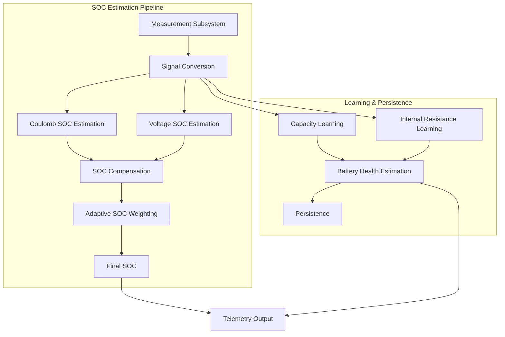

# BatteryGauge – Solution Architecture (v3)

## Overview

BatteryGauge is a modular battery monitoring system designed to provide reliable and user-friendly battery insight while remaining independent from vendor-specific cloud platforms.

The architecture separates **battery intelligence** from **user interface and connectivity**.  
This allows the battery monitoring logic to remain deterministic, hardware-close, and reusable across different user interfaces.

The system consists of two main nodes:

**Battery Intelligence Node**

Responsible for:

- measurement acquisition
- battery modelling
- state-of-charge estimation
- adaptive correction
- battery learning algorithms
- persistent battery knowledge

**User Interface Node ESP32**

Responsible for:

- dashboards
- visualization
- configuration
- networking
- logging

This separation keeps battery logic independent from UI technology and networking concerns.

---

# System Context

BatteryGauge measures battery behaviour through a dedicated measurement chain.

### Roles

| Component | Responsibility |
|----------|----------------|
Battery | Energy storage |
Shunt | Current sensing |
Measurement IC | Electrical measurement (voltage, current, charge) |
Battery Intelligence Node | Battery modelling and estimation |
User Interface Node | Visualization and user interaction |

---

# Architectural Principles

The architecture follows several design principles.

### Separation of concerns

Battery modelling and learning are isolated from the user interface.

### Deterministic measurement

Battery estimation occurs close to the sensor to avoid delays and noise from UI or networking tasks.

### Adaptive battery modelling

The system gradually learns real battery behaviour during normal operation.

### Modular functional pipeline

Battery estimation is implemented as a pipeline of functional stages.

### Persistence of learned behaviour

Battery characteristics are stored so the system improves over time.

### Robust operation

Data corruption, sensor errors, and battery replacement events are handled gracefully.

---

# Functional Architecture

The system is composed of several logical subsystems.

<insert drawing>

Each subsystem performs a clearly defined role.

---

# Measurement Subsystem

The measurement subsystem retrieves electrical properties from the battery through the measurement IC.

Primary measurements include:

- battery voltage
- current through the shunt
- temperature
- accumulated charge

These measurements form the raw input for the estimation pipeline.

---

# Signal Conversion

Raw sensor values must be translated into normalized electrical values.

This stage performs:

- voltage scaling
- current conversion
- charge register interpretation
- plausibility validation

The result is a consistent set of battery measurements used by the rest of the system.

---

# State-of-Charge Estimation

BatteryGauge determines state of charge using two complementary methods.

### Coulomb counting

The primary SOC estimate tracks the amount of charge flowing into and out of the battery.

Advantages:

- stable during load
- accurate over short time scales
- directly based on measured current

### Voltage based estimation

A secondary SOC estimate is derived from the battery voltage curve.

Advantages:

- stable during rest
- useful to correct drift
- provides a fallback estimate

Both methods are combined later in the SOC pipeline.

---

# SOC Compensation

Measured battery voltage changes with load due to internal resistance.
To compensate for this effect the system estimates the effective open-circuit voltage.

V_ocv = V_measured + I × R_internal

This allows the system to derive a more realistic voltage-based SOC estimate even when the battery is under load.

---

# Adaptive SOC Weighting

The final SOC value is calculated by combining two independent SOC estimates:

- coulomb SOC
- voltage SOC

The system dynamically adapts the influence of both sources.

Typical behaviour:

| Battery state | Dominant source |
|---------------|----------------|
Under load | Coulomb counting |
Resting battery | Voltage curve |

This adaptive weighting stabilizes SOC behaviour in real-world usage.

---

# Learning Subsystem

A major capability introduced in v3 is the automatic learning of battery characteristics.

The system continuously improves its understanding of the connected battery.

This behaviour is inspired by advanced battery monitors commonly used in marine and energy storage systems.

The learning subsystem derives:

- effective battery capacity
- internal battery resistance
- battery health
- confidence in the learned model

Learning occurs during normal use and does not require dedicated calibration cycles.

---

# Capacity Learning

Battery capacity changes over time due to aging and usage.

The system estimates effective capacity by observing real discharge behaviour.

When a meaningful discharge trajectory is observed, the system updates its capacity estimate using a smoothing function.

This prevents abrupt changes while allowing the estimate to gradually converge to the real battery capacity.

The learned capacity improves the accuracy of SOC estimation.

---

# Internal Resistance Learning

Battery internal resistance affects voltage behaviour under load.

The system estimates internal resistance by observing voltage changes caused by current transitions.

R = ΔV / ΔI

The resulting resistance estimate is used to improve voltage compensation.

Over time the system learns a realistic resistance value for the battery.

---

# Battery Health Estimation

Battery health is derived from the relationship between learned capacity and nominal capacity.

health = learnedCapacity / nominalCapacity

This produces a simple classification of battery condition.

Typical categories:

| Ratio | Interpretation |
|------|---------------|
|> 80% | Healthy |
|60–80% | Aging |
|40–60% | Poor |
|< 40% | Replacement recommended |

This provides a simple user-level interpretation of battery aging.

---

# Model Confidence

The system tracks the reliability of the learned model.

Confidence increases when:

- more discharge data is observed
- more current transitions are measured
- estimates become stable

Low confidence prevents early learning results from influencing SOC too strongly.

---

# Battery Swap Detection

Learned battery behaviour is only valid for the battery that generated the learning data.

The system therefore monitors for battery replacement events.

Typical detection conditions include:

- near-zero current
- sudden voltage changes inconsistent with normal behaviour

When a swap is detected the learned battery model is reset.

This ensures that a newly installed battery starts with a clean baseline.

---

# Persistence Layer

Learned battery characteristics are stored in non-volatile memory.

Persisted information includes:

- learned capacity
- internal resistance
- learning confidence
- cycle counters
- battery health classification

The persistence design prioritizes robustness.

Mechanisms include:

- record validation
- redundancy
- versioning
- data integrity checks

This ensures learned data survives power loss while remaining resilient against corruption.

---

# Telemetry Layer

The battery intelligence node produces normalized telemetry for the user interface node.

Typical telemetry includes:

- battery voltage
- current
- state of charge
- learned capacity
- internal resistance
- battery health
- model confidence

The telemetry layer deliberately exposes **interpreted battery information**, not raw sensor registers.

This simplifies the UI and avoids duplicating battery modelling logic.

---

# User Interface Node

The user interface node is responsible for presenting battery information to the user.

Responsibilities include:

- dashboard visualization
- configuration interfaces
- logging
- network access
- browser access

The UI node does not implement battery modelling.

Instead it relies on telemetry produced by the battery intelligence node.

This architectural separation keeps battery logic consistent and testable.

---

# Robustness and Safety

The system contains several mechanisms to maintain safe operation.

Examples include:

- sensor read validation
- measurement plausibility checks
- corrupted data detection
- battery swap recovery
- fallback SOC behaviour

These mechanisms ensure the monitor remains usable even when unexpected situations occur.

---

# Extensibility

The architecture is designed to allow future improvements.

Possible extensions include:

- chemistry-specific learning behaviour
- improved cycle detection
- long-term degradation analytics
- trend logging
- expanded telemetry
- additional UI visualizations

The separation between battery intelligence and UI allows these improvements without redesigning the core architecture.

---

# Summary

BatteryGauge v3 introduces a modular battery monitoring architecture that combines:

- deterministic measurement
- adaptive SOC estimation
- internal resistance modelling
- automatic battery learning
- persistent battery knowledge
- robust telemetry

The system evolves from a simple measurement bridge into a **self-learning battery intelligence platform**.

Key architectural separation:

**Battery Intelligence Node**

- sensing
- SOC estimation
- adaptive correction
- learning algorithms
- battery health estimation
- persistence

**User Interface Node**

- visualization
- dashboards
- configuration
- networking
- logging

This architecture provides a stable foundation for future expansion while maintaining clear separation between **battery modelling** and **user interaction**.

